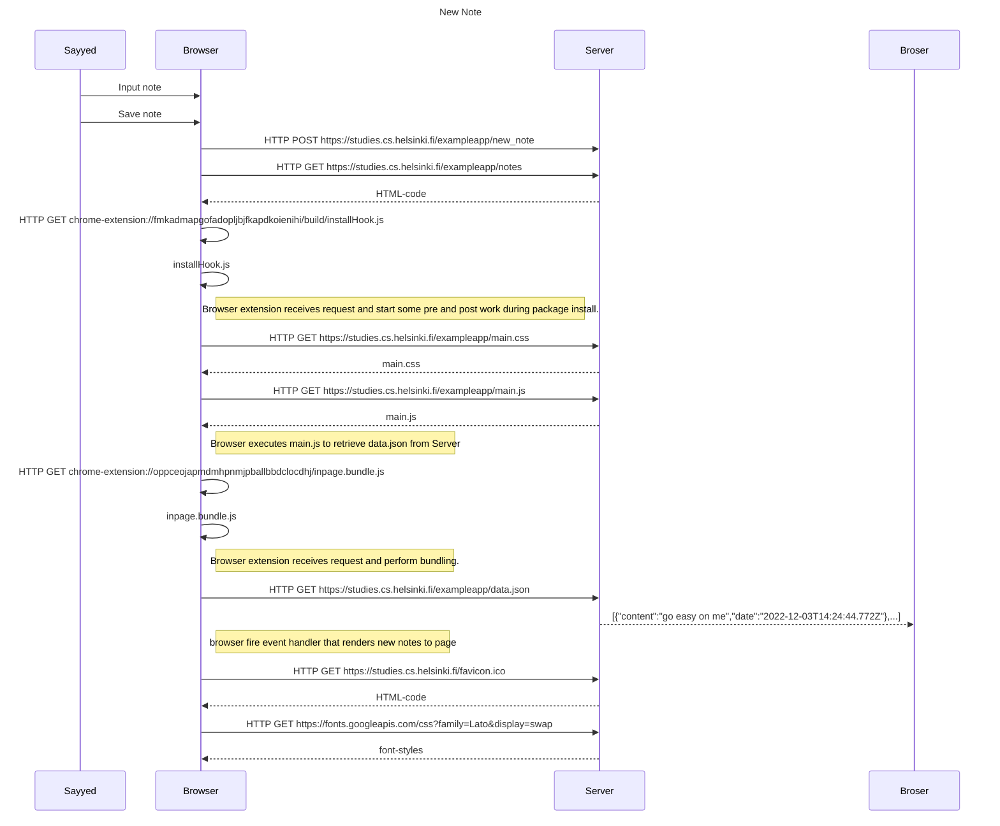

```mermaid
sequenceDiagram
    participant Sayyed
    participant Browser
    participant Server

title New Note

actor Sayyed
Sayyed->>Browser: Input note
Sayyed->> Browser: Save note
Browser->>Server: HTTP POST https://studies.cs.helsinki.fi/exampleapp/new_note
Browser->>Server: HTTP GET https://studies.cs.helsinki.fi/exampleapp/notes
Server-->>Browser: HTML-code
Browser->>Browser: HTTP GET chrome-extension://fmkadmapgofadopljbjfkapdkoienihi/build/installHook.js
Browser->>Browser: installHook.js
Note right of Browser: Browser extension receives request and start some pre and post work during package install.
Browser->>Server: HTTP GET https://studies.cs.helsinki.fi/exampleapp/main.css
Server-->>Browser: main.css
Browser->>Server: HTTP GET https://studies.cs.helsinki.fi/exampleapp/main.js
Server-->>Browser: main.js
Note right of Browser: Browser executes main.js to retrieve data.json from Server
Browser->>Browser: HTTP GET chrome-extension://oppceojapmdmhpnmjpballbbdclocdhj/inpage.bundle.js
Browser->>Browser: inpage.bundle.js
Note right of Browser: Browser extension receives request and perform bundling.
Browser->>Server: HTTP GET https://studies.cs.helsinki.fi/exampleapp/data.json
Server-->>Broser: [{"content":"go easy on me","date":"2022-12-03T14:24:44.772Z"},...]
Note right of Browser: browser fire event handler that renders new notes to page
Browser->>Server: HTTP GET https://studies.cs.helsinki.fi/favicon.ico
Server-->>Browser: HTML-code
Browser->>Server: HTTP GET https://fonts.googleapis.com/css?family=Lato&display=swap
Server-->>Browser: font-styles


```
