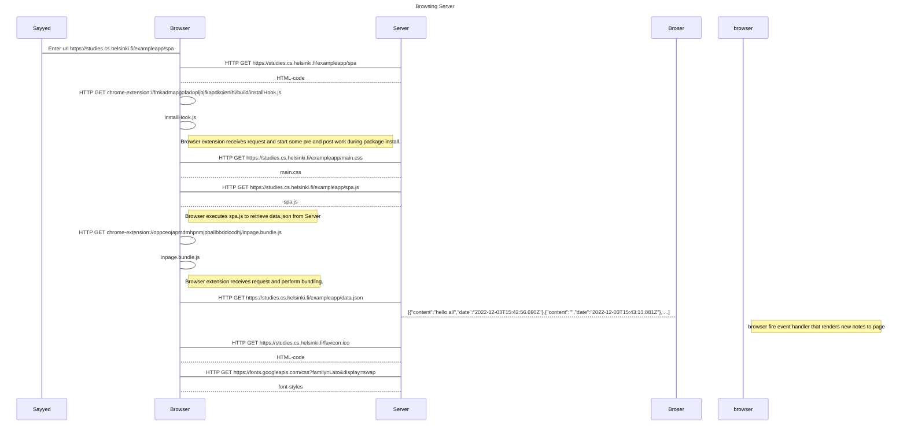

```mermaid
sequenceDiagram
    participant Sayyed
    participant Browser
    title Browsing Server

    Actor Sayyed
    Sayyed->Browser: Enter url https://studies.cs.helsinki.fi/exampleapp/spa
    Browser->Server: HTTP GET https://studies.cs.helsinki.fi/exampleapp/spa
    Server-->Browser: HTML-code
    Browser->Browser: HTTP GET chrome-extension://fmkadmapgofadopljbjfkapdkoienihi/build/installHook.js
    Browser->Browser: installHook.js
    Note right of Browser: Browser extension receives request and start some pre and post work during package install.
    Browser->Server: HTTP GET https://studies.cs.helsinki.fi/exampleapp/main.css
    Server-->Browser: main.css
    Browser->Server: HTTP GET https://studies.cs.helsinki.fi/exampleapp/spa.js
    Server-->Browser: spa.js
    Note right of Browser: Browser executes spa.js to retrieve data.json from Server
    Browser->Browser: HTTP GET chrome-extension://oppceojapmdmhpnmjpballbbdclocdhj/inpage.bundle.js
    Browser->Browser: inpage.bundle.js
    Note right of Browser: Browser extension receives request and perform bundling.
    Browser->Server: HTTP GET https://studies.cs.helsinki.fi/exampleapp/data.json
    Server-->Broser: [{"content":"hello all","date":"2022-12-03T15:42:56.690Z"},{"content":"","date":"2022-12-03T15:43:13.881Z"}, ...]
    Note right of browser: browser fire event handler that renders new notes to page
    Browser->Server: HTTP GET https://studies.cs.helsinki.fi/favicon.ico
    Server-->Browser: HTML-code
    Browser->Server: HTTP GET https://fonts.googleapis.com/css?family=Lato&display=swap
    Server-->Browser: font-styles
```    
